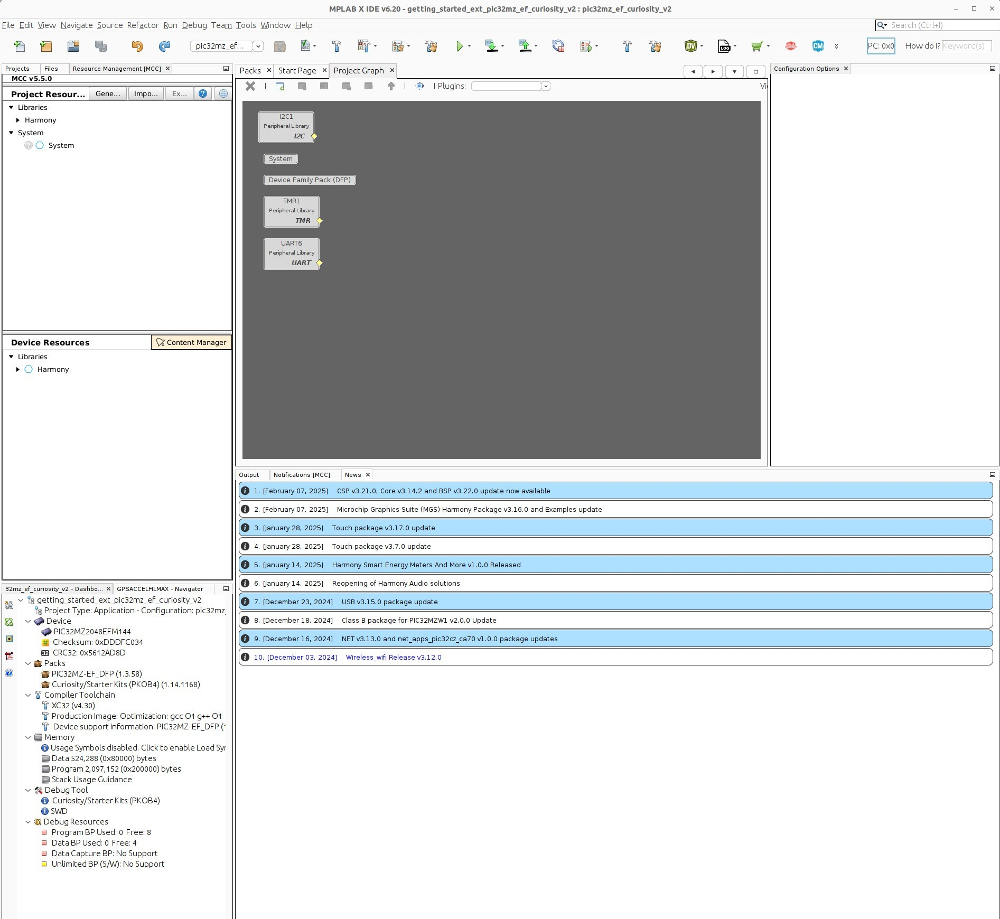

This file is part of eRCaGuy_MPLABX: https://github.com/ElectricRCAircraftGuy/eRCaGuy_MPLABX

Videos: 
1. Tool setup: https://youtu.be/0rNFSlsVwVw
1. Create Your First Project with PIC32MZ EF Using MPLAB® Harmony v3 and MCC - https://youtu.be/Z-8srAI8jow

Dev kit:
1. https://www.microchip.com/en-us/development-tool/dm320209
1. I/O1 Xplained Pro Extension Kit - https://www.microchip.com/Developmenttools/ProductDetails/ATIO1-XPRO
1. "Design Documentation" zip file: IC32MZ_EF Curiosity Board 2.0 Design Documentation - https://ww1.microchip.com/downloads/aemDocuments/documents/MCU32/ProductDocuments/BoardDesignFiles/PIC32MZ_EF-Curiosity-Board-2.0.zip 

Other references:

1. https://developerhelp.microchip.com/xwiki/bin/view/software-tools/harmony/new-proj-with-mcc/
1. \*\*\*\*\*Creating a Hello World Application on PIC32 Microcontrollers Using MPLAB Harmony v3 and the MPLAB Code Configurator (MCC) - https://ww1.microchip.com/downloads/aemDocuments/documents/MCU32/ProductDocuments/SupportingCollateral/Creating-a-Hello-World-Application-on-PIC32-Microcontrollers-Using-MPLAB-Harmony-v3-and-MPLAB-Code-Configurator-DS90003259.pdf
1. \*\*\*\*\*PIC32MZ2048EFM144 demo applications: https://mplab-discover.microchip.com/v2/category/com.microchip.code.examples/com.microchip.ide.project?dsl=PIC32MZ2048EFM144

Demo applications:
1. Getting started: Getting Started Extended Application on Curiosity PIC32MZ EF 2.0 Development Board: https://github.com/Microchip-MPLAB-Harmony/reference_apps/releases/latest/download/getting_started_ext.zip
1. Temp logger: EEPROM/Thumb drive Temperature Logger Application on Curiosity PIC32MZ EF 2.0 Development Board: https://github.com/Microchip-MPLAB-Harmony/reference_apps/releases/latest/download/getting_started_middleware.zip

## GS instructions to open up a demo application

1. Open MPLAB X IDE
1. Open the demo application's `.X` folder as a project in MPLAB X IDE
1. Prepare your local MCC Content Manager to be able to open a project in the MPLAB Code Configurator:
    1. Click the blue "CM" shield icon to open the "MCC Content Manager". 
    1. Click "Load Manifest" button. 
    1. Navigate to the `harmony-manifest-success.yml` file at `eRCaGuy_MPLABX/PIC32MZ_EF_2.0_Curiosity/demo_apps/getting_started_extended_app/getting_started_ext/firmware/src/config/pic32mz_ef_curiosity_v2/harmony-manifest-success.yml`, or equivalent, and open it.
    1. On the blue "Apply" button, click the dropdown. Review the changes, and click "Apply". 
        1. This updates your locally-selected Harmony packages to be prepared to configure the project. 
    1. Click the little X at the top-right of the "MCC Content Manager" tab to close the MCC Content Manager.  
1. Open the MPLAB Code Configurator v5: Tools --> Embedded --> "MPLAB Code Configurator v5: Open/Close"
    1. Some windows may open up, asking about fixing paths and stuff. Accept the new paths. Ex: from Windows paths using `\` to Linux paths using `/`. 
    1. IT WORKS! YAAAY! It opens!
    1. You'll now see this Project Graph tab: 
        1. 
1. In the "Project Graph" tab, click the "Plugins" dropdown menu to configure other peripherals. 
    1. _Tip:_ if you accidentally close the "Project Graph" tab, you can re-open it by going to Window --> "MPLAB Code Configurator v5" --> "Show All".
1. When done, I think you're supposed to generate code as follows:
    1. Go to the "Resource Management (MCC)" tab in the far top-left (near the normal "Projects" and "Files" tabs) --> go to the "Project Resources" tab --> click the "Generate" button.
1. Close the MPLAB Code Configurator v5: Tools --> Embedded --> "MPLAB Code Configurator v5: Open/Close". 
1. Done, I think. The tutorial video doesn't talk about nor show this really important step at all. The video tutorial is too superficial. 

